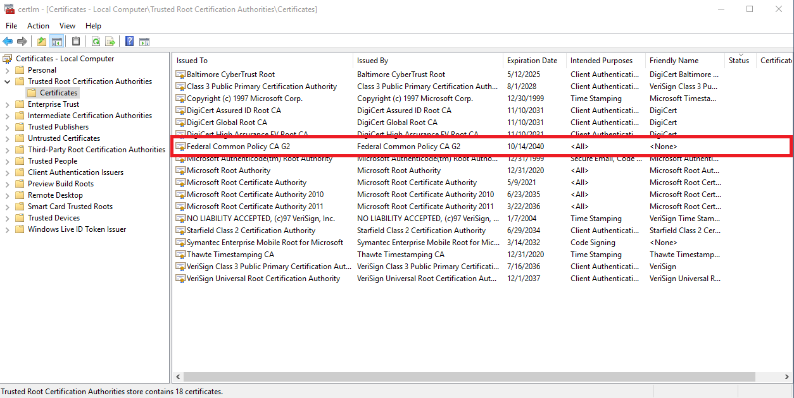
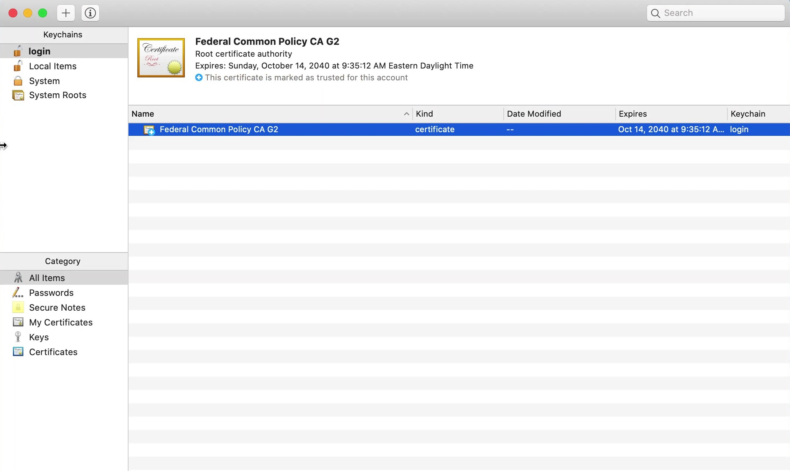
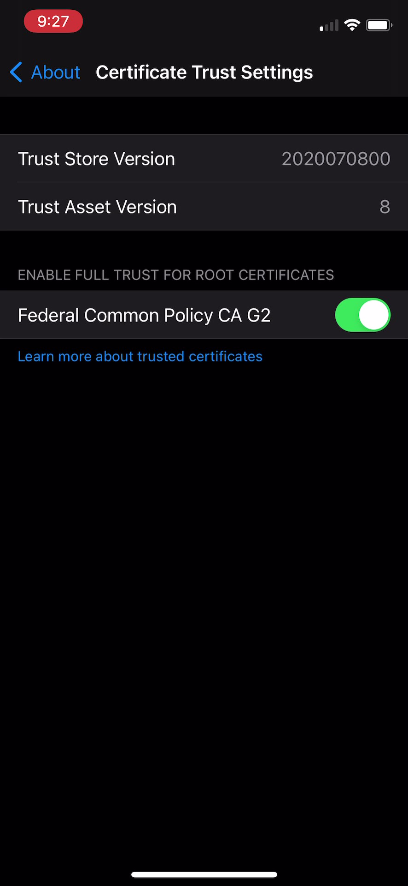



To verify that the Federal Common Policy CA (FCPCA) G2 certificate has been distributed to your agency's workstations and devices, use one of these options:

### Microsoft Solutions
- **Automated Solutions (*Recommended*)**
     - [Use BigFix](#use-bigfix)
     - [Use LANDesk 2016](#use-landesk-2016)
- **Manual Solutions**
     - [Use Microsoft Certificate Manager](#use-microsoft-certificate-manager)
     - [Use Microsoft Registry Editor](#use-microsoft-registry-editor)

### macOS Solutions
- [Use Keychain Access](#use-keychain-access)

### iOS Solutions
- [Use Settings](#use-settings)
	 
### Linux/Unix Solutions
- [Use the Command Line](#use-the-command-line)

<br>

---------------------------------------------------

## Microsoft Solutions 

### Use BigFix

1. Download the BigFix Enterprise Suite (.bes) analysis file: [*FPKIRootG2Detection.bes*](../FPKIRootG2Detection.bes){:target="_blank"}.

2. Use Certutil or another tool to verify the .bes file's SHA-256 hash (*required*):

    ```
          certutil -hashfile [DOWNLOAD_LOCATION]\FPKIRootDetection.bes SHA256
    ```
    
3. The file's hash must match this one:

    ```
          03bca16f7d21be344d954105b5ccb3caf578588cf6b8bd6f1cd03dfe298361bb
    ```

4. Log into *BigFix*:&nbsp;&nbsp;**Start** > **IBM BigFix** > **IBM BigFix Console**.
5. Import the *FPKIRootG2Detection.bes* file:&nbsp;&nbsp;**File** > **Import** > **Open**.

	The **Create Analysis** window appears.
	
6. Assign the file:&nbsp;&nbsp;for **Create in site**, select *site name*, and for **Create in domain**, select *domain name*. Click **Okay**.
7. On the left side panel, click **Analyses** to see a list of imported analysis files.
8. Click *Federal Common Policy CA G2 Distribution Detection* (i.e., *FPKIRootG2Detection.bes*) and click the **Results** tab to see the distribution analysis. If the analysis was not activated _by default_, right-click the file and then click **Activate Globally**. 
9. For each workstation or device listed, "*Has FCPCA G2 Been Distributed?*" should say **True**. If **False**, you'll need to investigate the cause of the failure. If you can't find a cause, please contact us at fpkirootupdate@gsa.gov.<br><br /> 
    {:style="width:90%;"}

### Use LANDesk 2016

**Note:**&nbsp;&nbsp;If your agency uses a version later than LANDesk 2016, please see [Ivanti: Install Root Certificates on Windows](https://help.ivanti.com/ap/help/en_US/fd/4.4/Content/FileDirector/Admin/3_Clients/Install_Root_Certificate_on_Windows.htm){:target="_blank"}{:rel="noopener noreferrer"}.<br>

1. Open *LANDesk 2016*:&nbsp;&nbsp;**Start** > **LANDesk Management** > **Desktop Manager**.
2. Create a custom registry data item:&nbsp;&nbsp;**Tools** > **Reporting/Monitoring** > **Manage software list**.
3. Expand **Custom Data**, and click **Registry items**.
4. Click **Add** to add a new registry item.
5. Add the data shown below for Windows 32-bit or 64-bit versions, based on GPO or Certutil distribution of FCPCA G2.
	
	**Microsoft Windows 32-bit Versions**
	- GPO Distribution
	```
		Root Key: HKLM
		Key: SOFTWARE\Policies\Microsoft\SystemCertificates\Root\Certificates\99b4251e2eee05d8292e8397a90165293d116028
		Value: BLOB
		Attribute Name: Custom Data – FCPCAG2Win32 GPO – Certificate
	```
	- Certutil Distribution
	```
		Root Key: HKLM
		Key: SOFTWARE\Microsoft\EnterpriseCertificates\Root\Certificates\99b4251e2eee05d8292e8397a90165293d116028
		Value: BLOB
		Attribute Name: Custom Data – FCPCAG2Win32 certutil – Certificate
	```
	
	**Microsoft Windows 64-bit Versions**
	- GPO Distribution
	```
		Root Key: HKLM
		Key: SOFTWARE\WOW6432Node\Policies\Microsoft\SystemCertificates\Root\Certificates\99b4251e2eee05d8292e8397a90165293d116028
		Value: BLOB
		Attribute Name: Custom Data – FCPCAG2Win64 GPO - Certificate
	```
	- Certutil Distribution
	```
		Root Key: HKLM
		Key: SOFTWARE\WOW6432Node\Microsoft\EnterpriseCertificates\Root\Certificates\99b4251e2eee05d8292e8397a90165293d116028
		Value: BLOB
		Attribute Name: Custom Data – FCPCAG2Win64 certutil - Certificate
	```

6. Create a query for the registry item:&nbsp;&nbsp;on the left side panel, expand **Network View**, and click **Queries**. 
7. Right-click **My Queries**, select **New Query**, and enter a *query name* (e.g., *FCPCA G2 Verification: Win32 Machines*).
8. Under **Machine Component**, expand **Computer**, click **Custom Data**, and select the registry item.
9. For **Boolean**, select **Exists**.
10. For **Displayed Scanned Values**, click **Insert** and add the *BLOB* value from above.
11. Double-click the *new query name* to verify FCPCA G2 distribution. The results will be similar to these:<br><br />
    {:style="width:90%;"}

### Use Microsoft Certificate Manager

1. Open *Microsoft Certificate Manager*:&nbsp;&nbsp;**Start**; then type **certlm.msc** and press **Enter**.
2. Go to **Trusted Root Certification Authorities** > **Certificates**. To see whether FCPCA G2 was successfully distributed, look for _Federal Common Policy CA G2_ shown with **Intended Purposes** of *ALL* and a **Friendly Name** of *None*, as shown here:<br><br />
    {:style="width:90%;"}
    

***Optional:***

1. Open *Microsoft Certificate Manager*:&nbsp;&nbsp;**Start**; then type **certlm.msc** and press **Enter**.
2. Select **Trusted Root Certification Authorities** from the left side panel, then select **View** > **Options**.
3. In the **View Options** box, select the **Physical certificate stores** checkbox. 
4. On the left side panel, click the **>** icon next to **Trusted Root Certification Authorities** to see the subdirectories.
5. Verify the distribution of FCPCA G2:<br />
     - For Certutil-distributed copies of FCPCA G2, click **Enterprise** > **Certificates**. *FCPCA G2 should appear in the certificates list.*<br>
     - For GPO-distributed copies of FCPCA G2, click **Group Policy** > **Certificates**. *FCPCA G2 should appear in the certificates list.*

### Use Microsoft Registry Editor

1. Verify that FCPCA G2 has been distributed to a specific workstation or device:&nbsp;&nbsp;open the *Microsoft Registry Editor*:&nbsp;&nbsp;**Start**; type **regedit.exe** and press **Enter**.
2. The following registry keys will appear for GPO- or Certutil-distributed copies of FCPCA G2: 

#### GPO-distributed FCPCA G2: 
	- HKLM:\SOFTWARE\Policies\Microsoft\SystemCertificates\Root\Certificates\99b4251e2eee05d8292e8397a90165293d116028\
	- HKLM:\SOFTWARE\WOW6432Node\Policies\Microsoft\SystemCertificates\Root\Certificates\99b4251e2eee05d8292e8397a90165293d116028\ 

#### Certutil-distributed FCPCA G2: 
	- HKLM:\SOFTWARE\Microsoft\EnterpriseCertificates\Root\Certificates\99b4251e2eee05d8292e8397a90165293d116028\
	- HKLM:\SOFTWARE\WOW6432Node\Microsoft\EnterpriseCertificates\Root\Certificates\99b4251e2eee05d8292e8397a90165293d116028\

<br>

--------------------------

## macOS Solutions 

### Use Keychain Access

1. Click the **Spotlight** icon and search for *Keychain Access*.

2. Double-click the **Keychain Access** icon.

3. Ensure that an entry for FCPCA G2 exists in the **login** or **System** Keychain Certificates repository.

{:style="width:85%;"}


<br>

--------------------------

## iOS Solutions 

### Use Settings

1. Select **Settings** > **About** > **Certificate Trust Settings**.
     
2. Verify that _Federal Common Policy CA G2_ has full trust enabled.

{:style="width:30%;"}

<br>

--------------------------

## Linux/Unix Solutions

### Use the Command Line
1. Launch the command line.

2. Run the following command:

    ```
        sha256sum /etc/ssl/certs/fcpcag2.*
    ```

	> **Note:** "fcpcag2" was the name of the file distributed to the operating system.


3. Verify the file hash matches the one listed [here]({../common/):

    ```
        5F9AECC24616B2191372600DD80F6DD320C8CA5A0CEB7F09C985EBF0696934FC  fcpcag2.crt
    ```
	
4. Run the following command to verify the Federal Common Policy CA G2 has an entry in the system's trust list:
   
   ```
        trust list | grep Federal
    ```


<br>


Next, [distribute the FCPCA G2 certificate to application trust stores](../distribute-apps/).
