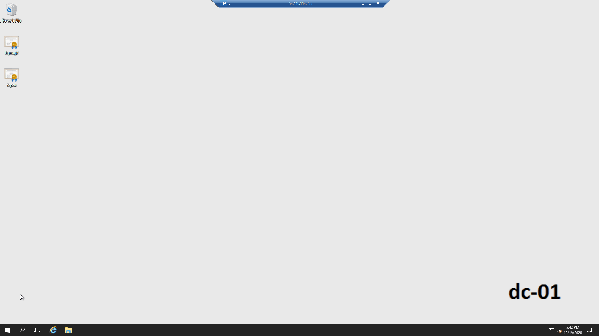



For the purpose of these steps, we refer to the existing Federal Common Policy CA (FCPCA) as *FCPCA G1*.

To migrate from the existing FCPCA G1 to the FCPCA G2 as your agency's federal trust anchor, you'll need to:
1. [**disable enterprise distribution**](#disable-distribution-of-the-fcpca-g1) of the FCPCA G1 as a _trusted root_ CA certificate, and
1. [**distrust**](#distrust-the-fcpca-g1) the FCPCA G1.




**FCPCA G1 certificate details**

| **FCPCA G1**  | **Certificate Details**                             |
| :--------  | :-------------------------------     |
| Federal Common Policy CA<br>(sometimes shown as *U.S. Government Common Policy*) | http://http.fpki.gov/fcpca/fcpca.crt |
| Distinguished Name | cn=Federal Common Policy CA, ou=FPKI, o=U.S. Government, c=US |
| Serial Number | 0130 |
| SHA-1 Thumbprint | 90 5f 94 2f d9 f2 8f 67 9b 37 81 80 fd 4f 84 63 47 f6 45 c1 |
| SHA-256 Thumbprint | 89 4e bc 0b 23 da 2a 50 c0 18 6b 7f 8f 25 ef 1f 6b 29 35 af 32 a9 45 84 ef 80 aa f8 77 a3 a0 6e |


## Disable distribution of the FCPCA G1

Reference the distribution mechanisms [here]({{site.baseurl}}/common/distribute-os/) to review the ways the FCPCA certificate **could** be distributed across your enterprise. Disable all existing distribution mechanisms. Sample procedures to disable the distribution of the FCPCA G1 are listed below using:

- [Disable distribution of the FCPCA G1](#disable-distribution-of-the-fcpca-g1)
  - [If the FCPCA was distributed using Microsoft Certutil](#if-the-fcpca-was-distributed-using-microsoft-certutil)
  - [If the FCPCA was distributed using a Microsoft GPO](#if-the-fcpca-was-distributed-using-a-microsoft-gpo)
  - [If the FCPCA was distributed using an Apple configuration profile](#if-the-fcpca-was-distributed-using-an-apple-configuration-profile)
- [Distrust the FCPCA G1](#distrust-the-fcpca-g1)
  - [Use Microsoft Group Policy Object](#use-microsoft-group-policy-object)
  - [Use macOS Terminal](#use-macos-terminal)

<br>

### If the FCPCA was distributed using Microsoft Certutil


1. Navigate to **Server Manager**.
1. Select **Tools**.
1. In the drop-down list, select **ADSI Edit**.
1. In the top navication, select **Action > Connect to** .
1. In the **Select a well known Naming Context** drop-down list, select **Configuration**, and click **OK**.
1. Browse to the **CN=AIA** directory (within "CN=Public Key Services, CN=Services"), right-click the entry for the FCPCA, and select **Delete**.
1. Browse to the **CN=Certification Authorities** directory (within "CN=Public Key Services, CN=Services"), right-click the entry for the FCPCA and select **Delete**.

<br>

### If the FCPCA was distributed using a Microsoft GPO


1. Navigate to **Server Manager**.
1. Select **Tools**.
1. Select **Group Policy Management** from the drop-down list.
1. Expand the **Group Policy Objects** directory.
1. Right-click the GPO distributing the FCPCA and select **Delete**.

<br>

### If the FCPCA was distributed using an Apple configuration profile
1. Identify how the profile is being distributed across the enterprise (e.g., over-the-air profile delivery or from an MDM server)
2. Use local knowledge to disable the distribution.  If you are having trouble with a specific product, email us at fpkirootupdate@gsa.gov.

<br>

## Distrust the FCPCA G1

Use one of the methods below to distrust the FCPCA G1.
- [Use Microsoft Group Policy Object (GPO)](#use-microsoft-group-policy-object)
- [Use macOS Terminal](#use-macos-terminal)

### Use Microsoft Group Policy Object



1. Navigate to **Server Manager**.
1. Select **Tools**.
1. Select **Group Policy Management** from the drop-down list.
1. Right-click your desired domain(s), and select **Create a GPO in this domain, and Link it here**.
1. Enter a GPO **Name** and click **OK**.
1. Right-click the newly created *Group Policy Object (GPO)* and click **Edit**.
1. Navigate to **Policies** > **Windows Settings** > **Security Settings** > **Public Key Policies**.  
1. Right-click **Untrusted Certificates**, and select **Import**. *The Certificate Import Wizard will open*. 
1. Browse to and select your copy of FCPCA G1.
1. Verify that the target **Certificate Store** presents **Untrusted Certificates**, and select **Next**.
1. Select **Finish** to complete the import.

	A success message appears.

1. Close the **Group Policy Management** window.
1. Wait for clients to consume the new policy.
1. (*Optional*) To force client consumption, click **Start**, type **cmd**, press **Enter**, and run the following command:
    ```
          gpupdate /force
    ```
	
Note: The following .gif shows you how to distrust the FCPCA G1 on Microsoft Server 2016.
{:style="width:85%;"}
<br>

<br>

### Use macOS Terminal



**Note:** Many Mobile Device Management (MDM) platforms allow administrators to push the command below across an enterprise, rather than running it on individual workstations. _Use automation wherever possible_.

1. Click the **Spotlight** icon and search for *Terminal*.
2. Double-click the **Terminal** icon (black monitor icon with white “>_”) to open a window.
3. Run the following command:

    ```
	$ sudo security delete-certificate -c "Federal Common Policy CA" /Library/Keychains/System.keychain && sudo security delete-certificate -c "Federal Common Policy CA" login.keychain
    ```
    
**Note:**&nbsp;&nbsp;This video shows you how to remove the FCPCA G1 certificate using the command line.
<br>
<video width="85%" controls>
  <source src="../../asssets/fpki/remove_command_line.mp4" type="video/mp4">
</video>
<br>


Finally, [verify migration to the FCPCA G2](../common/verify-migration/).


