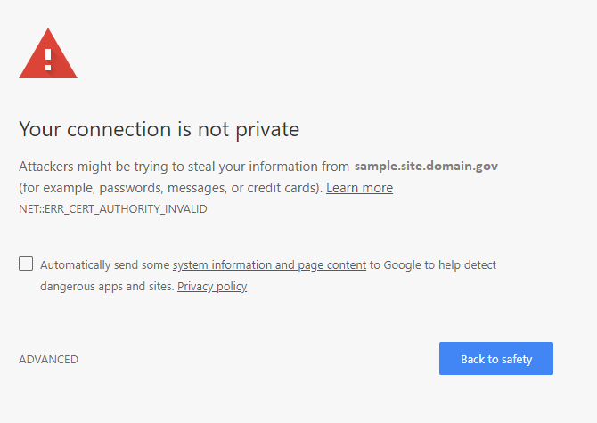
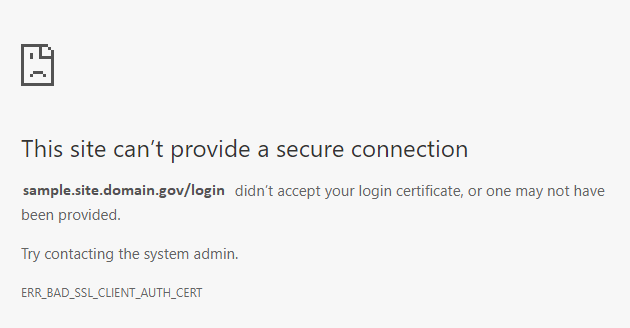
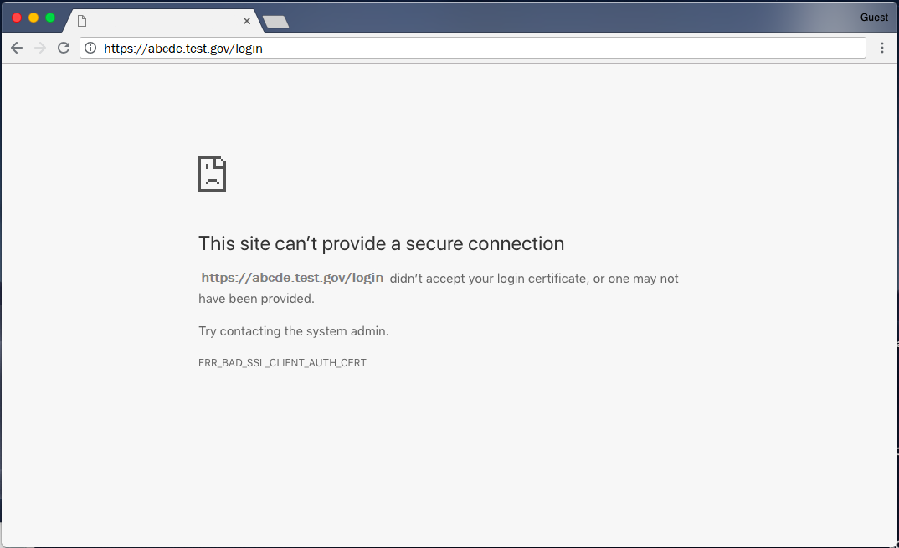
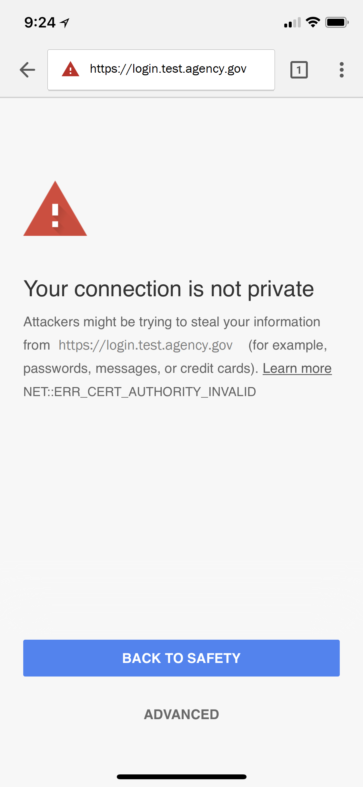

 
### Will my PIV credentials break or need to be updated or replaced when this change occurs?

No. PIV credentials will *not* be affected by this change. 

### Is the Federal Common Policy CA changing?

Yes. In **October 2020**, the Federal Government established a new Federal Public Key Infrastructure (FPKI) Root Certification Authority (CA) known as the **Federal Common Policy CA (FCPCA) G2**. 

Between December 2020 and May 2021, CAs cross-certified by the existing FCPCA will be migrated to the FCPCA G2. Once the migration is complete, the existing FCPCA will be decommissioned (planned for May 2021). 

### When will this change happen?

Tentative timeline:
- **October 14, 2020**: The Federal PKI Management Authority (FPKIMA) established the new FCPCA G2.
- **October 15, 2020**: The FPKIMA issued and distributed a cross certificate from the FCPCA G2 to the Federal Bridge CA G4.
- **November 18, 2020**: The FPKIMA issues and distributes certificates to migrate agency and affiliate CAs cross-certified by the existing FCPCA to the FCPCA G2 .
- **December 2020 to May 2021**: All agencies transition from using the existing FCPCA as a trust anchor to the FCPCA G2.
- **May 2021**: The FPKIMA decommissions the existing FCPCA.

### Which operating systems will this change affect?

All major operating systems (i.e., Microsoft Windows, macOS, iOS, *nix) will be affected.

### What happens if I don’t distribute the FCPCA G2?

1. **(*High Impact*) Authentication failures**
	- Workstations 
	- Websites  
	- Applications (internal and cross-agency)
	- Virtual Private Networks (VPNs)

2. **(*Medium Impact*) Error fatigue**
	- Unexpected application errors and system behavior for legacy and government-off-the-shelf (GOTS) products

3. **(*Low Impact*) Digital signature validation failures**
	- Email
	- Documents and files (for example, Microsoft Word)

### What errors can occur in Windows if I don't distribute the FCPCA G2?

*Sample Chrome error when a user navigates to an intranet site whose SSL/TLS certificate doesn't chain to a trusted root CA:*
      
     

*Sample Chrome error when PIV authentication fails because the user’s certificate doesn't chain to a trusted root CA:*
      
     

*Sample Microsoft Outlook error when a digital signature certificate for an email doesn't chain to a trusted root CA:*
      
      
     
	 
### What errors can occur in macOS if I don't distribute the FCPCA G2?

*Sample Safari error when a user navigates to an intranet site whose SSL/TLS certificate doesn't chain to a trusted root CA:*
      
     {:style="width:85%;"}
    
*Sample Safari error where client (PIV) authentication fails because a user’s certificate doesn't chain to a trusted root CA:*
      
     {:style="width:85%;"}
   
*Sample Chrome error when a user navigates to an intranet site whose SSL/TLS certificate doesn't chain to a trusted root CA:*
      
     {:style="width:85%;"}

*Sample Chrome error where client (PIV) authentication fails because a user’s certificate doesn't chain to a trusted root CA:*
      
     {:style="width:85%;"}

### What errors can occur in iOS if I don't distribute the FCPCA G2?

*Sample Safari error when a user navigates to an intranet site whose SSL/TLS certificate doesn't chain to a trusted root CA:*
      
     {:style="width:30%;"}

*Sample Chrome error when a user navigates to an intranet site whose SSL/TLS certificate doesn't chain to a trusted root CA:*
      
     {:style="width:30%;"}

### How can I verify that the FCPCA G2 has been successfully distributed to my workstation or device?

Please review the steps to [verify distribution of the FCPCA G2](../common/verify-os-distribution/).

### My agency gets PIV cards from [Issuer Name]. I won’t be affected by this change, right?

This change *does not* affect your PIV credential issuer, nor how agency credentials are generated or issued.

This change *does* affect how federal enterprise workstations and devices validate PIV credential certificates.  

### Do I need to distribute the FCPCA G2 to my Bring Your Own Device (BYOD) program device?

As a BYOD program device user, you'll need to distribute the FCPCA G2 if you:
- use your PIV credential to log into intranet sites or VPNs,
- validate PIV digital signatures in emails or documents, or
- navigate to intranet pages whose SSL/TLS certificates chain to the FCPCA G2.
